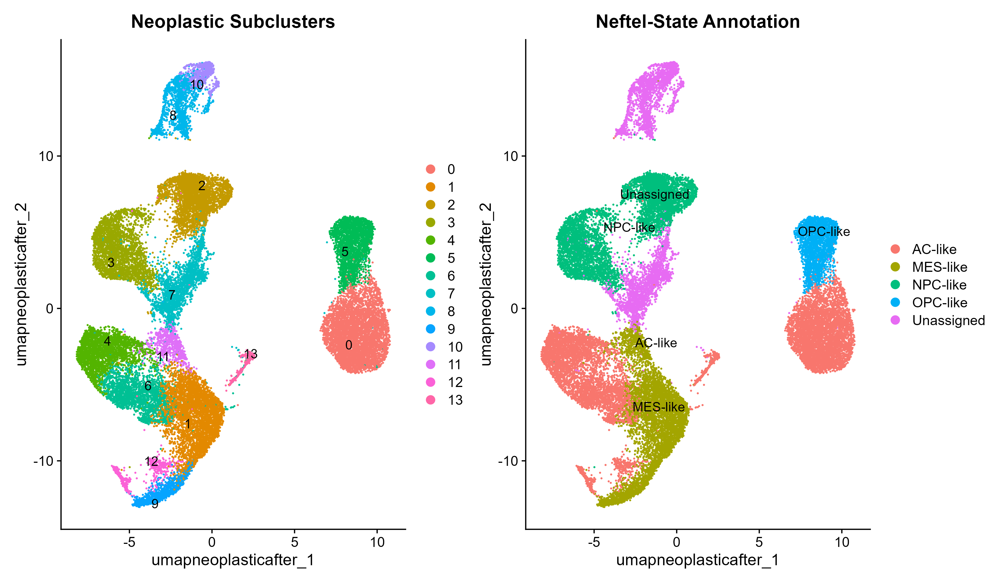
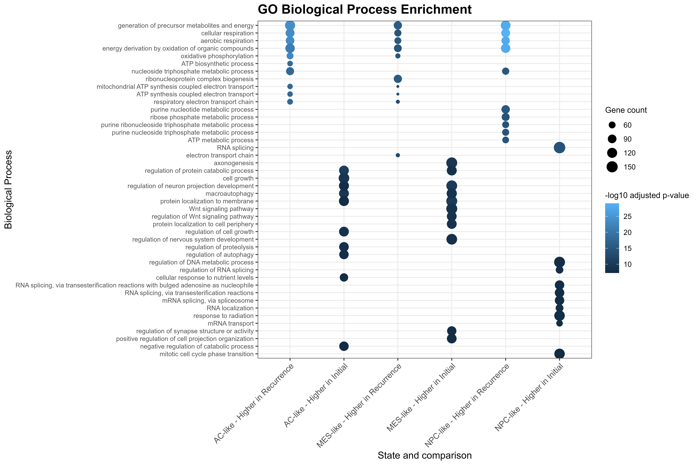

# scRNAseq-GBM-reanalysis

Single-cell RNA-seq reanalysis of glioblastoma dataset GSE229779, focusing on neoplastic transcriptional states and differences between Initial and Recurrent tumors.

## Biological Question

How do neoplastic GBM transcriptional states and their gene-expression programs differ between tumors at initial diagnosis and recurrence?

## Data

This project uses the publicly available single-cell RNA-seq dataset **GSE229779**.

Samples:

| Patient | Time point |
|---|---|
| GBM21 | Recurrence |
| GBM41 | Recurrence |
| GBM47 | Recurrence |
| GBM49 | Initial |
| GBM51 | Initial |
| GBM53 | Initial |

Raw count matrices are not stored in this repository because of their size.

Download the following files from GEO accession **GSE229779** and place them in the `data/` folder:

- `GSE229779_countsMatrix.tsv.gz`
- `GSE229779_cellMetadata.tsv.gz`

## Analysis Overview

The workflow included quality control and doublet removal, normalization and feature selection, PCA and Harmony integration, clustering, and broad cell-type annotation. Candidate neoplastic cells were then reclustered and annotated into AC-like, MES-like, NPC-like, OPC-like, or Unassigned transcriptional states using cluster markers and published GBM state-marker programs. Initial and Recurrent tumors were compared by state composition, within-state differential expression, and GO Biological Process enrichment.

## How to Run the Analysis

Run the scripts in numerical order because each step uses the output generated by the previous step.

---

### 00_LoadData.R

Loads the raw count matrix and creates the unfiltered Seurat object (`gbm`) used for downstream analysis.

The raw Seurat object is saved so that later steps can load it directly without rebuilding the object from the count matrix.

Main output:

- `data/gbm_raw_seurat.rds`

---

### 01_QC_DoubletDetection.R

Loads the raw Seurat object, calculates and visualizes quality-control metrics, evaluates the existing QC filtering, detects potential doublets using `scDblFinder`, and removes predicted doublets.

The QC-passed singlet object is saved for downstream analysis.

Main output:

- `data/gbm_QC_singlets.rds`

---

### 02_Normalization_HVG_Scaling.R

Loads the QC-passed singlet object and performs:

- LogNormalize normalization
- identification of 2,000 highly variable features
- visualization of highly variable genes
- scaling of the expression data

The processed Seurat object is saved for dimensionality reduction and integration.

Main output:

- `data/gbm_normalized_HVG_scaled.rds`

---

### 03_Dimensionality_Reduction_Clustering_and_UMAP.R

Loads the normalized and scaled Seurat object and performs PCA.

A UMAP is first generated before integration to visualize patient-associated structure. 

Harmony is then used to integrate the samples, after which the neighborhood graph is reconstructed and cells are clustered.

A post-Harmony UMAP is generated to assess sample mixing after integration.

Main output:

- `data/gbm_harmony_clustered.rds`

---

### 04_CellType_Annotation.R

Loads the Harmony-integrated and clustered Seurat object and identifies cluster-specific marker genes using `FindAllMarkers()`.

The top cluster markers are compared with canonical lineage marker programs using `DotPlot()` to support broad cell-type annotation.

Broad populations include:

- Myeloid cells
- T cells
- Oligodendrocytes
- Endothelial cells
- Fibroblast/stromal cells
- Candidate neoplastic cells

Clusters without convincing normal-lineage marker programs are conservatively retained as `Candidate neoplastic`.

Main outputs:

- `data/gbm_all_cluster_markers.csv`
- `data/gbm_top10_markers_per_cluster.csv`
- `data/gbm_broad_celltype_annotated.rds`

Additional figures include the broad cell-type annotation and canonical marker DotPlot.

---

### 05_Neoplastic_Cell_Analysis.R

Loads the broad-cell-type annotated object and subsets the `Candidate neoplastic` population.

Within the neoplastic compartment, the script:

- recalculates variable features
- rescales the data
- performs neoplastic-specific PCA
- evaluates informative principal components
- visualizes patient-associated structure before Harmony
- performs Harmony integration
- reconstructs the neighborhood graph
- identifies neoplastic subclusters
- generates post-Harmony UMAPs
- identifies cluster-specific marker genes
- evaluates published GBM transcriptional-state marker programs
- manually annotates AC-like, MES-like, NPC-like, OPC-like and Unassigned states
- compares Initial and Recurrent tumors
- performs differential-expression analysis within AC-like, MES-like and NPC-like states
- performs GO Biological Process enrichment

OPC-like cells were detected only in Initial tumors in the manual state annotation. Therefore, an Initial-versus-Recurrence differential-expression comparison and downstream GO enrichment could not be performed for the OPC-like state.

Main intermediate outputs:

- `data/gbm_neoplastic_clustered.rds`
- `data/gbm_neoplastic_annotated.rds`
- `data/gbm_neoplastic_all_markers.csv`
- `data/gbm_neoplastic_top30_markers_per_cluster.csv`

Main differential-expression outputs:

- `data/DE_AC_Recurrence_vs_Initial.csv`
- `data/DE_MES_Recurrence_vs_Initial.csv`
- `data/DE_NPC_Recurrence_vs_Initial.csv`

Main GO enrichment outputs:

- `data/GO_AC_Initial.csv`
- `data/GO_AC_Recurrence.csv`
- `data/GO_MES_Initial.csv`
- `data/GO_MES_Recurrence.csv`
- `data/GO_NPC_Initial.csv`
- `data/GO_NPC_Recurrence.csv`
- `data/GO_summary_top10.csv`
- `data/GO_summary_combined.png`

Main figures:

- `figures/neoplastic_subclusters_Neftel_states.png`
- `figures/GO_summary_combined.png`

Final output:

- `data/gbm_neoplastic_final.rds`

## Requirements:

- R 4.5.1
- Seurat 5.5.1
- harmony 2.0.5
- scDblFinder 1.24.10
- SingleCellExperiment 1.32.0
- presto 1.1.0
- clusterProfiler 4.20.0
- org.Hs.eg.db 3.23.1
- ggplot2 4.0.3
- patchwork 1.3.2
- dplyr 1.2.1
- data.table 1.18.4

## Results

The neoplastic-cell analysis revealed differences in transcriptional-state composition and GO Biological Process enrichment patterns between Initial and Recurrent tumors, with substantial inter-patient heterogeneity.

| State | Initial cells | Recurrence cells |
|---|---:|---:|
| AC-like | 6939 | 3935 |
| MES-like | 4153 | 1857 |
| NPC-like | 845 | 5547 |
| OPC-like | 2529 | 0 |
| Unassigned | 1106 | 3374 |

### Neoplastic subclusters and Neftel-state annotation

Neoplastic subclusters were grouped into AC-like, MES-like, NPC-like, OPC-like, or Unassigned states based on cluster-specific markers and published GBM transcriptional-state marker programs.

OPC-like cells were detected only in Initial tumors in this dataset using the manual Neftel-state annotation. Therefore, a within-state Initial-versus-Recurrence differential-expression comparison could not be performed for the OPC-like state.

Differential-expression and GO Biological Process enrichment analyses were performed separately for the AC-like, MES-like and NPC-like states.

### GO Biological Process enrichment

The figure summarizes the top enriched GO Biological Processes among genes with higher expression in Initial or Recurrent tumors within the AC-like, MES-like, and NPC-like states.

## Team
- [Mohammed Ali](https://github.com/MohammednhAli)
- [Hussein Kamal](https://github.com/husseinkamal22)
- [Basmala Ahmed](https://github.com/BasmalaAhmed-606)
- [Menna](https://github.com/menna13579)
- [Aya Hegab](https://github.com/ayahegab1)

## Data Source

The single-cell RNA-seq data and published metadata used in this reanalysis are available from GEO under accession **GSE229779**.

## Citation

Please cite the original study associated with GEO accession **GSE229779** when reusing the source dataset.